# Kwitch — Análisis Completo del Proyecto

## 1. Descripción General

**Kwitch** es una plataforma de *streaming* en vivo distribuida, desarrollada en **Java 17** como proyecto universitario para el ramo **Computación Paralela y Distribuida**. Simula las funciones centrales de servicios como Twitch —gestión de canales en vivo y chat en tiempo real— utilizando exclusivamente **sockets TCP** y **serialización de objetos Java**.

La interfaz es de **consola/CLI** (sin interfaz gráfica), lo que permite concentrar el rigor de ingeniería en los mecanismos de comunicación distribuida: transparencia de ubicación, sincronización de hilos y mitigación de fallos parciales.

| Aspecto | Detalle |
|---|---|
| **Lenguaje** | Java 17 |
| **Build System** | Maven 3.6+ |
| **Dependencias externas** | Ninguna (solo JDK estándar) |
| **Comunicación** | Sockets TCP + Object Serialization |
| **Concurrencia** | Threads, ExecutorService, Colecciones thread-safe |
| **Licencia** | CC0 1.0 Universal (Dominio Público) |

---

## 2. Arquitectura del Sistema

El sistema se compone de **4 procesos Java independientes** que se comunican exclusivamente por red mediante **sockets TCP** en dos puertos locales:

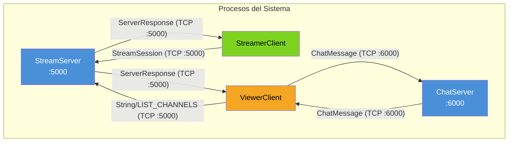

### 2.1 Procesos y Puertos

| Proceso | Puerto | Rol |
|---|---|---|
| **StreamServer** | 5000 | Gestiona canales activos y notificaciones de estado a viewers |
| **ChatServer** | 6000 | Gestiona mensajería por canal |
| **StreamerClient** | — | Interfaz del streamer: publica y controla su transmisión |
| **ViewerClient** | — | Interfaz del viewer: se suscribe a un canal y participa en el chat |

### 2.2 Flujo de Datos entre Procesos

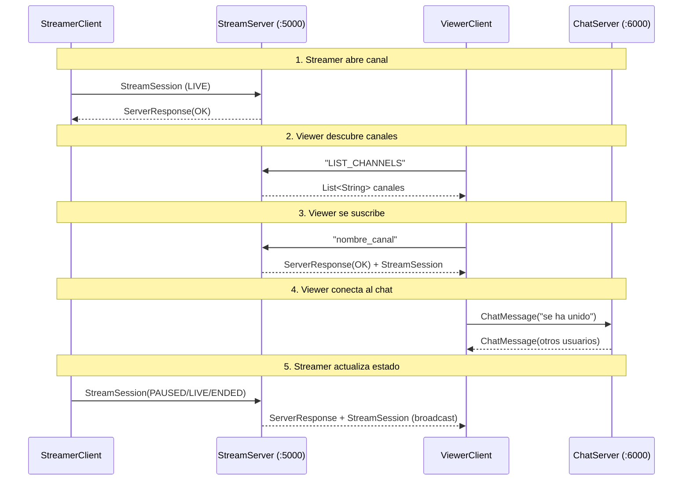

---

## 3. Estructura del Proyecto

```
Kwitch-cParalela/
├── ANALISIS_KWITCH.md              ← Este archivo
├── README.md                       Documentación principal
├── Documentacion.md                Notas internas de desarrollo
├── LICENSE                         Licencia CC0 1.0
└── kwitch-cparalela/               Módulo Maven
    ├── pom.xml                     Configuración Maven (Java 17)
    └── src/main/java/cpyd/
        ├── StreamServer.java       Servidor de streams (puerto 5000)
        ├── ClientHandler.java      Handler por cliente (streamer o viewer)
        ├── ChatServer.java         Servidor de chat (puerto 6000)
        ├── ChatClientHandler.java  Handler por cliente de chat
        ├── StreamerClient.java     Cliente consola del streamer
        ├── ViewerClient.java       Cliente consola del viewer
        ├── StreamSession.java      DTO del canal/stream
        ├── ChatMessage.java        DTO del mensaje de chat
        ├── ServerResponse.java     Wrapper de respuesta del servidor
        ├── StreamStatus.java       Enum: LIVE, PAUSED, ENDED
        ├── ResponseStatus.java     Enum: OK, ERROR, CHANNEL_CLOSED
        └── Main.java               Placeholder (sin uso activo)
```

---

## 4. Diagrama de Clases

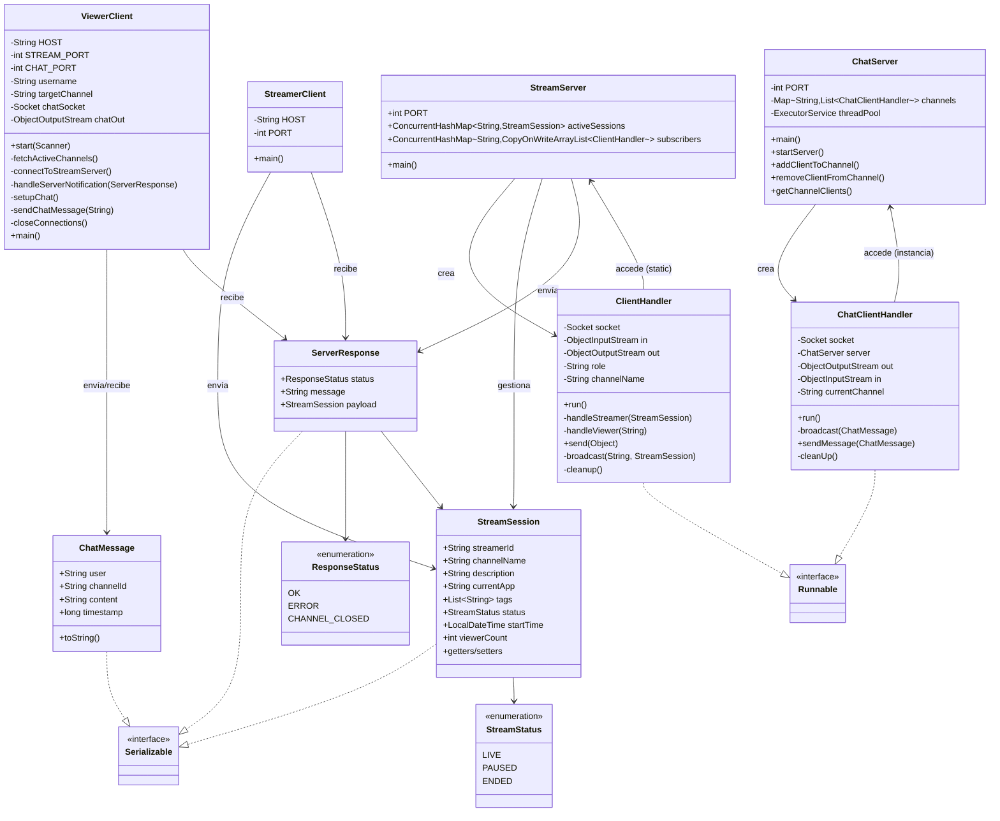

---

## 5. Descripción Detallada de Componentes

### 5.1 DTOs (Data Transfer Objects)

Son objetos serializables que viajan por la red a través de `ObjectInputStream`/`ObjectOutputStream`.

#### `StreamSession` — Representa un canal/stream activo

| Campo | Tipo | Descripción |
|---|---|---|
| `streamerId` | `String` | Identificador del streamer |
| `channelName` | `String` | Nombre del canal (clave única en el mapa) |
| `description` | `String` | Descripción del canal |
| `currentApp` | `String` | Aplicación/juego que se transmite |
| `tags` | `List<String>` | Etiquetas del canal |
| `status` | `StreamStatus` | Estado actual: `LIVE`, `PAUSED` o `ENDED` |
| `startTime` | `LocalDateTime` | Marca temporal de inicio del stream |
| `viewerCount` | `int` | Conteo de espectadores (actualizado por el servidor) |

```java
// StreamerClient.java:66-68
StreamSession session = new StreamSession(
    streamerId, channelName, description, currentApp, tags
);
out.writeObject(session);
```

#### `ChatMessage` — Representa un mensaje de chat

| Campo | Tipo | Descripción |
|---|---|---|
| `user` | `String` | Nombre del remitente |
| `channelId` | `String` | Canal al que pertenece |
| `content` | `String` | Contenido del mensaje |
| `timestamp` | `long` | `System.currentTimeMillis()` al crearse |

```java
// ChatMessage.java:29
return String.format("[%s] %s: %s", channelId, user, content);
```

#### `ServerResponse` — Envoltorio de respuesta del servidor

| Campo | Tipo | Descripción |
|---|---|---|
| `status` | `ResponseStatus` | `OK`, `ERROR` o `CHANNEL_CLOSED` |
| `message` | `String` | Mensaje legible para el cliente |
| `payload` | `StreamSession` | Opcional: estado actualizado del canal (puede ser `null`) |

### 5.2 Enums

#### `StreamStatus` — Ciclo de vida del stream

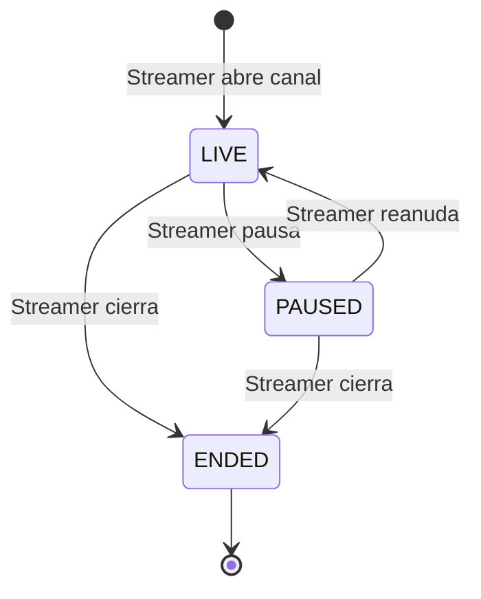

#### `ResponseStatus` — Resultado de operaciones del servidor

- **OK** — Operación exitosa
- **ERROR** — Error (ej: canal no encontrado)
- **CHANNEL_CLOSED** — El streamer cerró el canal (broadcast a viewers)

### 5.3 Servidores

#### `StreamServer` — Gestión de canales y notificaciones

- **Puerto:** 5000
- **Modelo:** Thread-per-client (cada `ClientHandler` en un `new Thread()`)
- **Estructuras compartidas** (static, accesibles por todos los handlers):

```java
// Mapa: nombre_canal -> StreamSession
public static final ConcurrentHashMap<String, StreamSession> activeSessions;

// Mapa: nombre_canal -> lista de handlers de viewers suscritos
public static final ConcurrentHashMap<String, CopyOnWriteArrayList<ClientHandler>> subscribers;
```

**Razón de ser `static`:** Todos los `ClientHandler` necesitan acceder a estos mapas para registrar canales, suscribir viewers, hacer broadcast y limpiar al desconectarse. Al ser `static` y usar `ConcurrentHashMap`, se evitan bloqueos explícitos (`synchronized`).

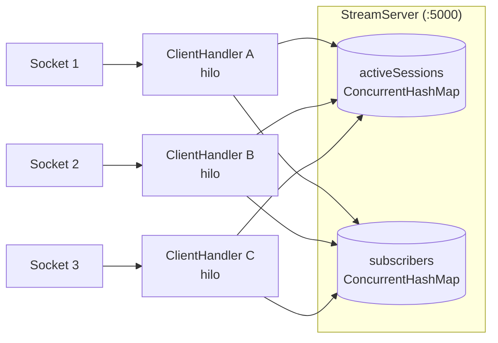

#### `ChatServer` — Mensajería en tiempo real por canal

- **Puerto:** 6000
- **Modelo:** Thread pool (`Executors.newCachedThreadPool()`)
- **Estructura compartida:**

```java
private final Map<String, List<ChatClientHandler>> channels = new ConcurrentHashMap<>();
```

**Ventaja del thread pool** sobre `new Thread()`: Reutiliza hilos inactivos para clientes de chat (operaciones I/O-bound), evitando la sobrecarga de crear un hilo OS por cada conexión.

### 5.4 Manejadores de Clientes

#### `ClientHandler` — Discriminación de rol por primer mensaje

El protocolo de `StreamServer` usa **discriminación por tipo del primer objeto** para determinar el rol del cliente:

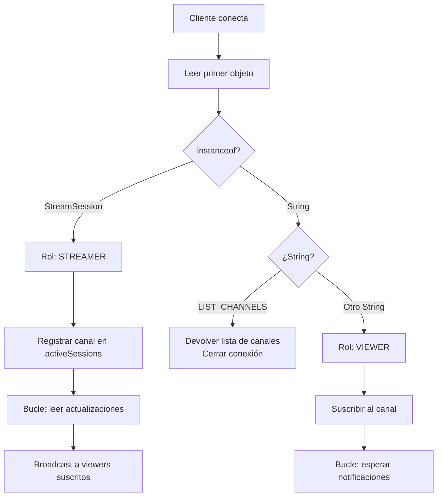

**`handleStreamer()`** — Lógica del streamer:
1. Registra el `StreamSession` en `activeSessions`
2. Inicializa lista de suscriptores vacía en `subscribers`
3. Envía confirmación `ServerResponse(OK)` al streamer
4. Entra en bucle de lectura de actualizaciones de `StreamSession`
5. En cada actualización: ajusta `viewerCount`, actualiza el mapa, hace broadcast a viewers
6. Si el estado es `ENDED`, sale del bucle y el `finally` ejecuta `cleanup()`

**`handleViewer()`** — Lógica del viewer:
1. Verifica que el canal exista en `activeSessions`
2. Si no existe: responde `ServerResponse(ERROR)` y retorna
3. Si existe: agrega `this` (el handler) a `subscribers[canal]`
4. Envía `ServerResponse(OK)` con el estado actual del canal
5. Entra en bucle dormido (`Thread.sleep(3000)`) hasta que el socket se cierre

**`broadcast()`** — Multicast a viewers:

```java
// ClientHandler.java:194-207
for (ClientHandler viewer : viewers) {
    viewer.send(notification);
}
```

Si el estado es `ENDED`, envía `ResponseStatus.CHANNEL_CLOSED`.

**`cleanup()`** — Limpieza garantizada (en `finally`):
- **VIEWER:** lo elimina de `subscribers[channelName]`
- **STREAMER:** elimina el canal de `activeSessions` y `subscribers`
- Cierra el socket

#### `ChatClientHandler` — Distribución de mensajes de chat

1. Lee el primer `ChatMessage` para obtener el `channelId`
2. Se registra en el canal (`server.addClientToChannel()`)
3. Hace broadcast del mensaje de entrada a los demás participantes
4. Entra en bucle: por cada `ChatMessage` recibido, lo retransmite a todos los clientes del mismo canal **excepto el remitente**
5. Timeout de omisión: 60 segundos (`socket.setSoTimeout(60000)`)

### 5.5 Clientes

#### `StreamerClient` — Flujo del streamer

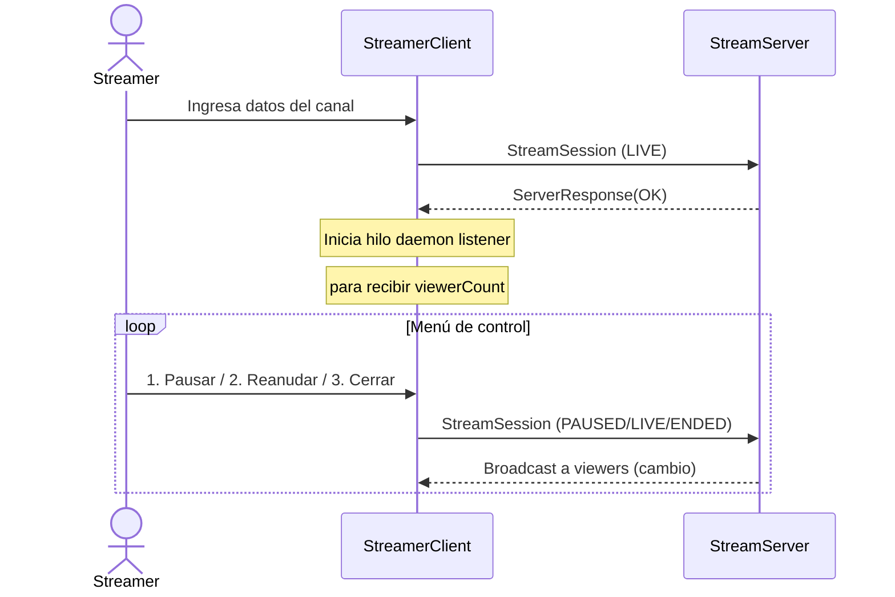

**Hilo daemon listener:** Corre en segundo plano escuchando `ServerResponse` del servidor. Cuando un viewer se conecta/desconecta, el servidor actualiza `viewerCount` y lo envía de vuelta al streamer, quien lo imprime en consola.

#### `ViewerClient` — Flujo del viewer

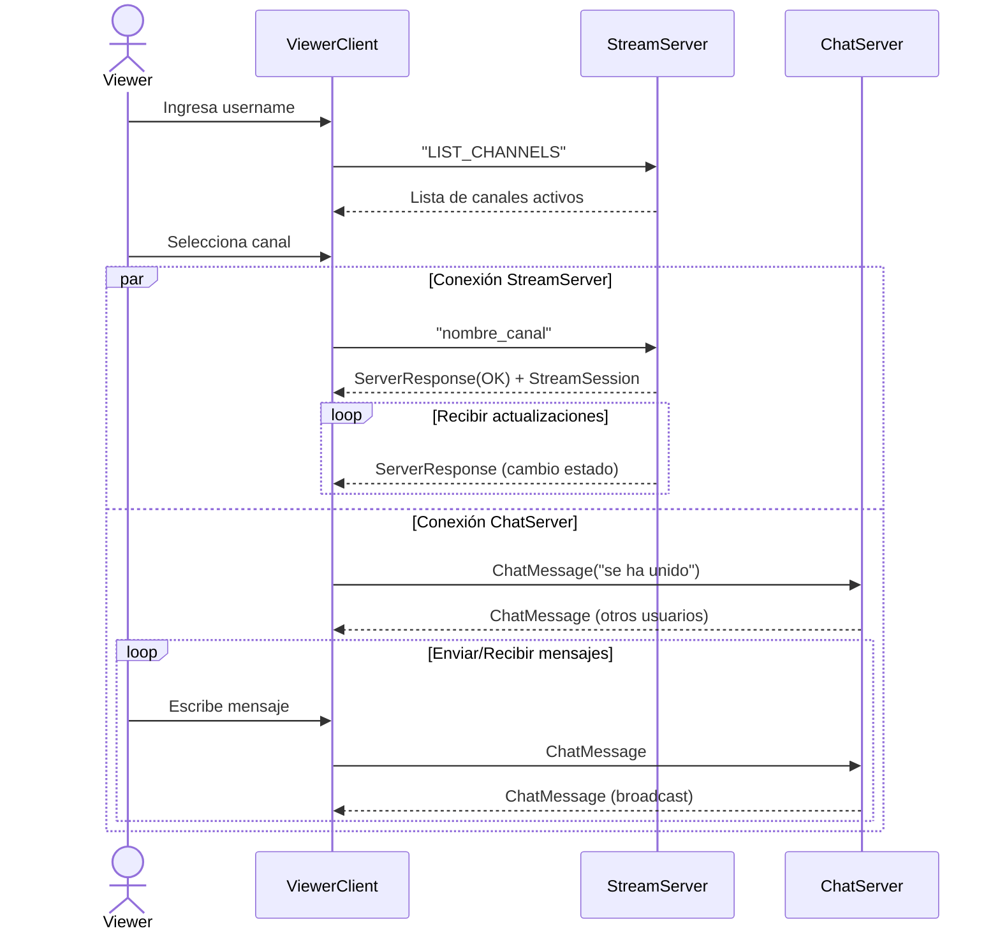

**Doble conexión simultánea:** El `ViewerClient` mantiene dos sockets TCP abiertos al mismo tiempo:
1. **StreamServer (:5000)** — para recibir actualizaciones de estado del canal
2. **ChatServer (:6000)** — para enviar y recibir mensajes de chat

El hilo de StreamServer tiene **reconexión automática** con backoff de 5 segundos.

---

## 6. Modelo de Concurrencia

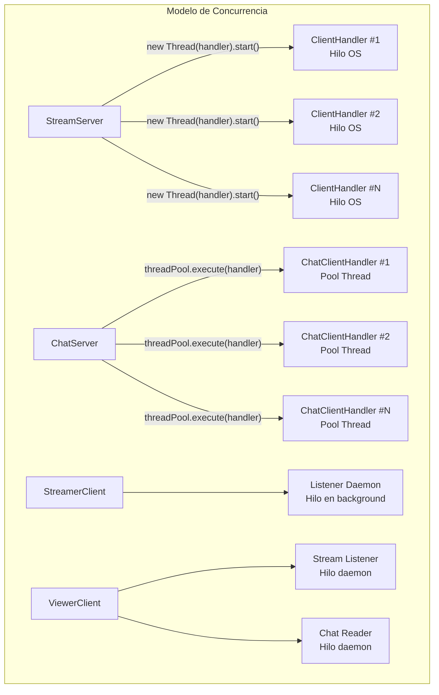

| Componente | Estrategia | Justificación |
|---|---|---|
| **StreamServer** | `new Thread(handler).start()` | Cada cliente necesita un hilo dedicado para el bucle de lectura/bloqueo |
| **ChatServer** | `Executors.newCachedThreadPool()` | Clientes I/O-bound: reutiliza hilos, crea nuevos solo si es necesario |
| **StreamerClient** | Daemon thread listener | No debe impedir la terminación del proceso principal |
| **ViewerClient** | 2 daemon threads | Uno para stream, otro para chat; mueren con el main |

### Estructuras Thread-Safe

| Colección | Uso | Propiedad |
|---|---|---|
| `ConcurrentHashMap<String, StreamSession>` | Canales activos | Lectura/escritura concurrente sin bloqueos |
| `ConcurrentHashMap<String, CopyOnWriteArrayList<ClientHandler>>` | Suscriptores por canal | Lecturas frecuentes (broadcast), escrituras ocasionales (suscribir/desuscribir) |
| `CopyOnWriteArrayList<ChatClientHandler>` | Clientes de chat por canal | Iteración segura durante broadcast sin `ConcurrentModificationException` |

---

## 7. Modelo de Fallos

```mermaid
flowchart TD
    FALLO[Fallo detectado] --> TIPO{Tipo de fallo}
    TIPO -->|Crash| CRASH[SocketException / EOFException]
    TIPO -->|Omisión| OMISION[SocketTimeoutException]
    TIPO -->|Lógico| LOGICO[Canal no existe]

    CRASH --> LIMPIEZA[cleanup():\n- Remover de subscribers\n- Remover de activeSessions\n- Cerrar socket]
    OMISION --> LIMPIEZA

    LOGICO --> ERROR[ServerResponse(ERROR)]
    ERROR --> VIEWER[ViewerClient recibe error\nSystem.exit()]
```

| Tipo de fallo | Detección | Mecanismo | Respuesta |
|---|---|---|---|
| **Crash del cliente** | `SocketException`, `EOFException` | Capturadas en `catch` de `run()` | `cleanup()` elimina referencias fantasma |
| **Omisión (cliente silencioso)** | `SocketTimeoutException` | `socket.setSoTimeout(180000)` en stream, `60000` en chat | Limpieza como si fuera crash |
| **Canal inexistente** | `containsKey()` == false | Validación en `handleViewer()` | `ServerResponse(ERROR)` y retorno |
| **Caída del StreamServer** | `IOException` en daemon thread | `connectToStreamServer()` en `ViewerClient` | Reconexión automática cada 5 segundos |
| **Canal cerrado** | Estado `ENDED` | `broadcast()` con `ResponseStatus.CHANNEL_CLOSED` | Viewer notificado; socket se cierra eventualmente |

```java
// Detección de omisión en StreamServer (ClientHandler.java:52)
socket.setSoTimeout(180000); // 3 minutos sin datos → timeout

// Detección de omisión en ChatServer (ChatClientHandler.java:29)
socket.setSoTimeout(60000); // 1 minuto sin datos → timeout

// Reconexión automática en ViewerClient (ViewerClient.java:103-129)
while (true) {
    try (Socket streamSocket = new Socket(HOST, STREAM_PORT)) { ... }
    catch (SocketException | EOFException e) {
        System.err.println("Conexión perdida. Reintentando en 5 segundos...");
    }
    Thread.sleep(5000); // backoff fijo de 5s
}
```

---

## 8. Protocolo de Comunicación

### 8.1 Formato de Mensajes

Todos los mensajes viajan como **objetos Java serializados** sobre TCP:

```
[TCP Header] [Object Header] [serialized data: StreamSession | ChatMessage | ServerResponse | String | List]
```

### 8.2 Secuencia de Operaciones Detallada

#### Apertura de Canal (Streamer → Server)

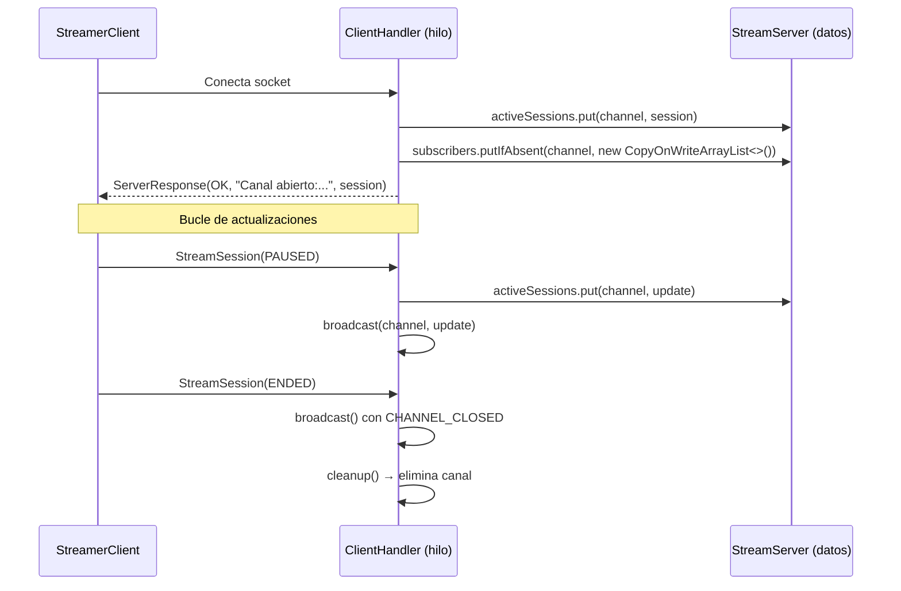

#### Suscripción de Viewer y Chat

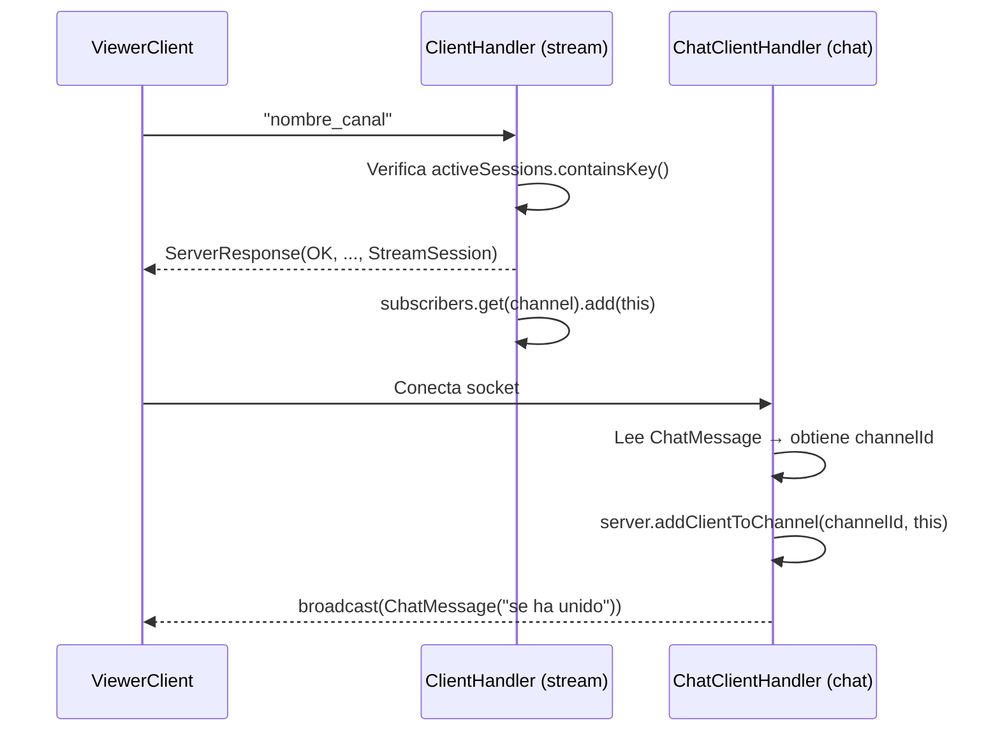

---

## 9. Compilación y Ejecución

### Requisitos

```bash
java -version   # Java 17 o superior
mvn -version    # Maven 3.6 o superior
```

### Compilación

```bash
cd kwitch-cparalela
mvn compile
```

Los `.class` quedan en `target/classes/`.

### Ejecución (4 terminales)

```bash
# Terminal 1 - StreamServer (puerto 5000)
java -cp target/classes cpyd.StreamServer

# Terminal 2 - ChatServer (puerto 6000)
java -cp target/classes cpyd.ChatServer

# Terminal 3 - StreamerClient
java -cp target/classes cpyd.StreamerClient

# Terminal 4 - ViewerClient
java -cp target/classes cpyd.ViewerClient
```

### Orden de inicio

1. **StreamServer** (primero, los clientes lo necesitan)
2. **ChatServer** (segundo, los viewers lo necesitan)
3. **StreamerClient** (tercero, abre un canal)
4. **ViewerClient** (cuarto, descubre canales y se suscribe)

---

## 10. Resumen Técnico

| Componente | Archivo | Líneas | Rol |
|---|---|---|---|
| StreamServer | `StreamServer.java` | 56 | Servidor TCP :5000, thread-per-client |
| ClientHandler | `ClientHandler.java` | 239 | Lógica de streamer/viewer, broadcast, cleanup |
| ChatServer | `ChatServer.java` | 65 | Servidor TCP :6000, thread pool, canales de chat |
| ChatClientHandler | `ChatClientHandler.java` | 95 | Distribución de mensajes de chat |
| StreamerClient | `StreamerClient.java` | 152 | CLI del streamer, menú de control |
| ViewerClient | `ViewerClient.java` | 207 | CLI del viewer, doble conexión, reconexión |
| StreamSession | `StreamSession.java` | 56 | DTO del canal |
| ChatMessage | `ChatMessage.java` | 31 | DTO del mensaje |
| ServerResponse | `ServerResponse.java` | 46 | DTO de respuesta |
| StreamStatus | `StreamStatus.java` | 13 | Enum LIVE/PAUSED/ENDED |
| ResponseStatus | `ResponseStatus.java` | 13 | Enum OK/ERROR/CHANNEL_CLOSED |
| **Total** | **12 fuentes** | **976** | |

---

## 11. Autores

| Autor | Rol |
|---|---|
| Diego Alvarado Mondaca | DEV 1 |
| Ignacia Brahim Lara | DEV 2 |
| Bárbara Oyarzo Alfaro | DEV 3 |
| Vicente Palma Lucero | DEV 4 |
| Javier Retamal Frez | DEV 5 |
| Ariel Villar San José | DEV 6 |

**Curso:** Computación Paralela y Distribuida

**Licencia:** CC0 1.0 Universal (Dominio Público)
